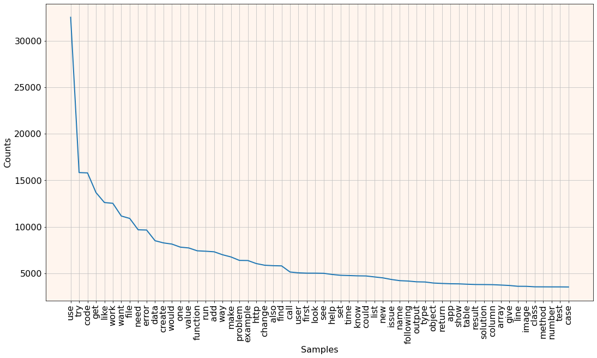
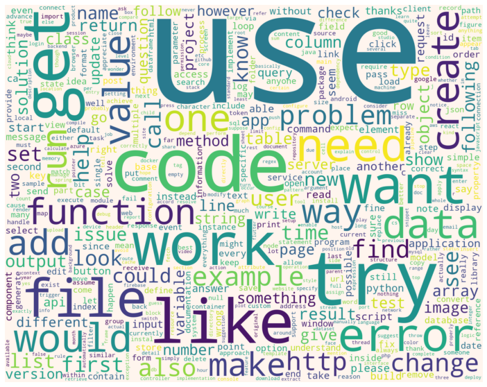

# StackOverflow-Frequencies
В рамках данного репозитория произведен анализ постов (вопросов и ответов) на [StackOverflow](http://stackoverflow.com) 
в период с 16.08.2021 по 15.02.2022 на предмет частотности слов и фраз.

Для получения данных использовался ресурс [StackExchange](https://data.stackexchange.com/stackoverflow/).

Запрос, подготавливающий необходимые данные можно посмотреть по [ссылке](https://data.stackexchange.com/stackoverflow/revision/1559588/1906023/), а также в файле [six-months-posts.sql](https://github.com/DenisKorotchenko/StackOverflow-Frequencies/blob/master/six-months-posts.sql).

В рамках подготовки данных по наиболее частотным словам была проведена их лематизация и удаление стоп-слов, в результате чего получился следующий результат:

| слово  | вхожений | слово    | вхождений |
|:-------|---------:|:---------|----------:|
| use    |    32543 | function |      7414 |
| try    |    15833 | run      |      7368 |
| code   |    15796 | add      |      7308 |
| get    |    13683 | way      |      6989 |
| like   |    12610 | make     |      6753 |
| work   |    12524 | problem  |      6381 |
| want   |    11158 | example  |      6368 |
| file   |    10898 | http     |      6041 |
| need   |     9674 | change   |      5860 |
| error  |     9650 | also     |      5812 |
| data   |     8500 | find     |      5791 |
| create |     8265 | call     |      5132 |
| would  |     8137 | user     |      5042 |
| one    |     7809 | first    |      5008 |
| value  |     7720 | look     |      5007 |

Также можно посмотреть на график наиболее частотных слов:

А также на облако слов:

Для анализа самых частотных фраз  предлагаю посмотреть на следующие две вещи:
Во-первых, список самых частотных 5-грамм:

| фраза                         | вхождений |
|:------------------------------|----------:|
| is there a way to             |       638 |
| i don't know how              |       320 |
| don't know how to             |       304 |
| is there any way to           |       276 |
| but i don't know              |       206 |
| what am i doing wrong         |       191 |
| i get the following error     |       191 |
| here is my code :             |       174 |
| i don't want to               |       169 |
| i am trying to create         |       163 |
| but when i try to             |       149 |
| i want to create a            |       145 |
| want to be able to            |       143 |
| i am trying to use            |       140 |
| any help would be appreciated |       138 |

А также список collocations (т.е. таких сочетаний слов, что они встречаются чаще всего именно в таком сочетании):

| фраза          |
|:---------------|
| look like      |
| something like |
| would like     |
| don't know     |
| visual studio  |
| make sure      |
| please help    |
| error message  |
| don't work     |

Код, обрабатывающий и поготавливающий приведённые выше данные можно посмотреть в [файле](https://github.com/DenisKorotchenko/StackOverflow-Frequencies/blob/master/analysis.ipynb).